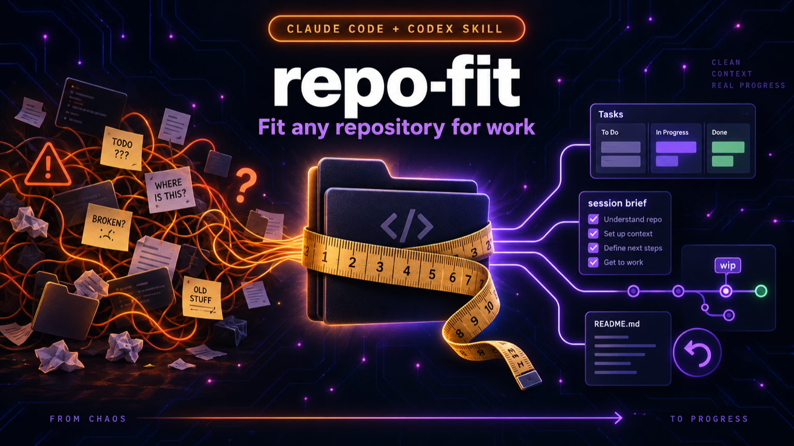

<p align="center">
  
</p>

# repo-fit

[](https://github.com/JimmySadek/repo-fit/actions/workflows/test.yml) [](CHANGELOG.md) [](LICENSE)

**Give your project a memory, so every work session starts where the last one stopped.**

repo-fit is for people who do real work with an AI assistant such as Claude Code or Codex: notes, research, plans, decisions, client work, a product, a company. It sets up your project folder so that nothing gets lost between sessions, your assistant always knows what is open, and your work is saved safely as you go.

It works with a brand-new project and with one you have had for years. It looks at what you already have, suggests only what is missing, and changes nothing without showing you first.

## Is this for you?

- You are a **founder, product manager, designer, marketer or consultant**, and you use an AI assistant to think and write, not only to code.
- You keep **notes, research and decisions** for a project, and you are tired of re-explaining everything at the start of each session.
- You have a **project folder that grew without structure**, and you want order without moving or rewriting anything.
- You work with **both Claude Code and Codex**, and you want them to follow the same rules.

You do not need to be a developer. You need an AI assistant and about 10 minutes.

**It is not** a second brain or a search engine. It does not read the internet, it does not build a database, and it does not replace your assistant. It gives your assistant a tidy place to work.

## What you get

| In plain words | What it looks like |
|---|---|
| **A briefing at the start of every session** | Before your assistant says a word, it reads a short summary: where you are, what is open, what to do next. |
| **One list of everything open** | Tasks, questions and ideas live in one place, each with an owner and a next step. Nothing is "somewhere in a chat". |
| **Your work saved automatically, safely** | Small automatic saves while you work. Never on your main version, never sent anywhere. You stay in control. |
| **A memory that does not rot** | Your assistant gets reminded of notes nobody links to and notes that went quiet, so they get merged, linked or archived. |
| **The same rules for every assistant** | One short rulebook that Claude Code and Codex both read: capture by default, search before saying "unknown", ask before deciding. |
| **It fits what you already have** | Your own files stay where they are. repo-fit points at them instead of making copies. |

Here is a real briefing from a small test project (two lines left out to keep it short):

```text
📍 acme-notes · main · 7 uncommitted · last commit 2026-10-02
🔄 Active (1): B-001 Fill in the README, people page and current view → Write the one-sentence purpose in README.md
➡️ Suggested start: B-001 Write the one-sentence purpose in README.md
🧹 Review queue: 4 nobody links to (notes/launch-plan.md · notes/meetings/2026-09-12-acme-call.md · +2 more)
```

## How it works

```
1. LOOK          2. CHOOSE                3. WORK
It reads your    It suggests what is      Every session: briefing,
project and      missing. You say yes     one open list, automatic
reports. It      or no to each step.      saves, reminders.
changes nothing. Nothing is overwritten.
```

Every change is shown to you first, keeps a backup, and can be undone with one command. It never uploads your files anywhere.

## Start in 10 minutes

The easiest way is through your AI assistant. You will not type any command yourself.

**1. Get repo-fit onto your computer.** Click the green **Code** button at the top of this page, then **Download ZIP**, and unzip it somewhere you will remember (for example a folder called `tools`). If you already use Git, `git clone` works too.

**2. Make sure Node.js is installed.** It is a free program that repo-fit's small scripts run on. If you are not sure, your assistant can check and tell you. Download: [nodejs.org](https://nodejs.org), version 18 or newer.

**3. Open your project in Claude Code or Codex**, and paste this sentence, with the path to the unzipped folder:

> Read INSTALL.md in the repo-fit folder at `/path/to/repo-fit` and set up this project with it. Show me what you would change before you change anything, and explain it in plain words.

The assistant will look at your project, tell you what is already fine, suggest what to add, and ask for your yes on each step. Say no to anything you do not want. That is the whole setup.

**4. Next session**, open the project again. The briefing appears by itself.

Prefer to run things yourself? See the [technical reference](docs/reference.md).

## A few words on safety

- **It changes nothing without showing you first.** Every step is a preview, then your yes.
- **Everything it writes can be undone.** It keeps a backup and a receipt of each change.
- **Your files never leave your computer.** It does not upload, publish, or send anything. The one exception is optional and asks first: creating an empty, private backup location for your project on GitHub or GitLab.
- **It never reads the contents of files that look like secrets** (passwords, keys). It only warns you if such a file is in a risky place.

The [full list of what it reads and when it uses the network](docs/reference.md#security-and-privacy) is in the reference.

## Where this stands

**Public beta, version 0.5.0.** Built and used by one person so far, on a Mac, with Claude Code. Automated tests pass on Mac, Linux and Windows. Codex support is written to the official documentation but has not been tried live yet. If you try it, [tell us what happened](https://github.com/JimmySadek/repo-fit/issues): that is the most useful thing you can do right now.

## For developers

Everything technical lives in one page: commands, the four scripts, how it adapts to a repo that has its own system, the review queue, autosave rules, security details, tests, and what is not built yet.

- [Technical reference](docs/reference.md)
- [INSTALL.md](INSTALL.md): the step-by-step an AI assistant follows
- [CONTRIBUTING.md](CONTRIBUTING.md) and [CHANGELOG.md](CHANGELOG.md)

MIT licence. Made by [Jimmy Sadek](https://github.com/JimmySadek).
